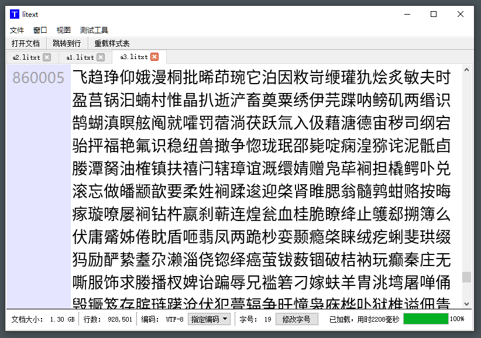

# litext (Lite Text)

## 项目介绍

本项目围绕着 "快速打开和流畅使用超大文本文件" 这一主题，旨在提供一套可以舒适地处理超大文本文件的 GUI 程序。

我最初想要开发这套软件的想法来源于工作中对超大文本日志文件的处理需求。虽然我可以使用 grep、less 等 UNIX 系的命令完成工作，但我认为排查 BUG 有时需要一些灵感，而图形化的操作则更有助于灵感的出现。

虽然有一些针对日志分析的程序，但它们大多数已经几乎脱离了文本编辑器的范畴，我希望我的这个程序更像一个通用的纯文本编辑器。

正如项目名称所强调的，本程序尤其注意各方面的轻量化：

* 部署：不使用平台级的技术，诸如 Java 或 .NET，所有运行时的逻辑都直接位于操作系统之上，没有中间层。
* 内存：对于特定的程序配置来说，单个文件使用的内存上限是固定的，也是可配置的，总的内存占用只取决于操作的文件的数量。例如，即便打开了一个 10GB 的文件，实际上也只会使用几十或上百 MB 的内存（这取决于配置）。
* 手感：不会在 GUI 线程中执行长时间的逻辑，GUI 线程只用来处理不得不由 GUI 线程处理的事情。做为 GUI 程序，保持响应是很重要的。
* 功能：如果某个功能已经由其它的程序很好得提供了，我就不会再提供了，例如我不会让程序尝试理解各种编程语言。我会把大部分的精力放在例如如何更充分地挖掘计算机性能，以便让文件打开地更快，或者如何让文本渲染更快。

## 下载

请点击下面的版本链接以打开对应版本的下载页面：

[v0.0.1](https://gitee.com/haocxy/litext/releases/v0.0.1)

## 体验说明

本软件针对超大文本文件，例如几个 GB 的文本文件。

如果您想体验本软件，请通过程序菜单 “测试工具 - 生成大文件” 功能，生成一个超大的文本文件。

生成的文本文件的内容由常用的汉字随机生成。

## 软件截图

## 技术要点介绍

基于 “使用超大文本文件的人大概也在使用不错的 CPU“ 这一假设，这个程序在首次加载某个文件时会尽可能多地使用 CPU 资源（仅仅是 CPU），这一过程很快。毕竟对于高性能的个人计算机而言，CPU 要比内存闲得多。而在其它时候，对 CPU 的使用也是非常谨慎的。

而如果重复打开某个还未被修改的文件，就不会像首次打开时使用尽可能多的 CPU 资源了。这是因为程序会为每个文件维护一个 KB 级别的很小的数据库。只有在首次打开时或者文件被修改后才需要重新创建这一数据库。所以，如果重复打开某个超大的文本文件，只需要一瞬间即可打开，以至于会让人忘记正在打开一个超大的文件。

* 注：目前的版本还没有实现加载已经创建的数据库的逻辑，每次都是当成首次打开，这是因为这个逻辑太简单了，我优先实现那些可能对整体规划有影响的功能。如果您发现我的程序在重复打开某个文件时变得很快，那估计是因为我忘了改 README。

此外，程序还是跨平台的，做为一个买不起 Apple 设备的程序员，我在开发过程中全程都同时在 Windows 和 Ubuntu 两个平台进行构建和操作。虽然我只用了两个平台，但核心的逻辑是和平台无关的，没有使用类似于 Windows GDI 之类的依赖于平台的组件。在我的经济状况好转后，我可以很轻易地将它在更多的平台上构建和操作。

## 已知问题

* 问题: 对小文件支持差, 假如打开很多个小文件, 可能会占用过多的计算机资源

  原因: 目前的开发是针对大文件的, 未来我会为小文件提供专用的支持, 这很容易做到, 只需要为抽象的文档类 Document 类增加一个用于小文件的实现类即可

## 开发环境搭建

TODO

